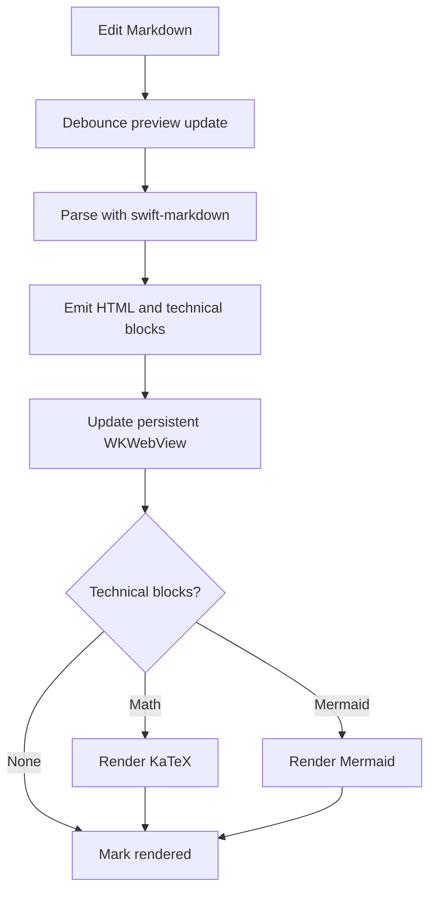
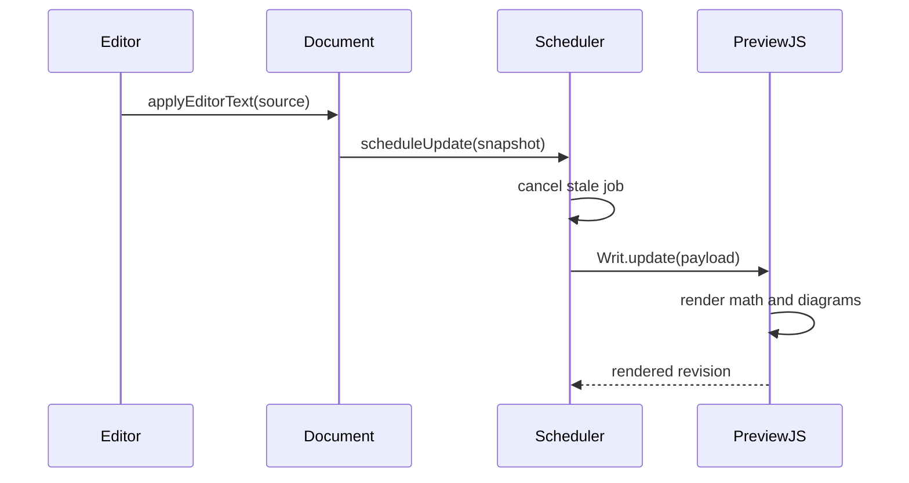
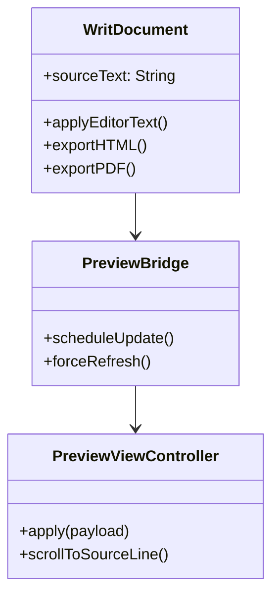
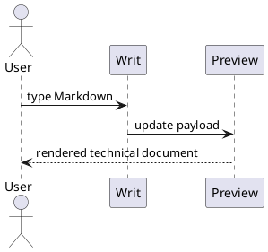
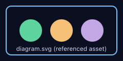
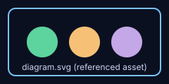

# Writ Feature Visual Verification

> [!NOTE]
> Open this document in Writ using split view. The rendered preview should be readable, styled, and fully local. Export it to HTML and PDF after visual inspection to confirm rendered technical content survives export.

> [!TIP]
> Toggle the outline sidebar while this document is open. The many headings below should populate the outline and provide jump targets.

> [!IMPORTANT]
> This file intentionally includes one missing image and one invalid Mermaid diagram near the end so the diagnostics ribbon can be verified.

> [!WARNING]
> Raw HTML and SVG examples below include safe and unsafe content. Unsafe content should be stripped or neutralized in the preview.

> [!CAUTION]
> If a browser alert appears, an unknown app scheme launches, or raw script executes, the sanitization/navigation guard has failed.

## 1. Document Shape, Typography, And Front Matter

The top of this document starts with YAML front matter. In preview, it should render as a compact front-matter table before the H1. This paragraph checks normal body typography, line length, spacing, and wrapping.

A hard break follows this sentence using two trailing spaces.  
This line should sit directly below it, not as a separate paragraph.

A backslash line break follows this sentence.\
This line should also sit directly below it.

Unicode rendering: cafe, naive, resume, 日本語, Привет, μαθηματικά, emoji ✅ ⚠️ ❌.

---

## 2. Inline Markdown Formatting

This sentence contains **bold**, *italic*, ***bold italic***, ~~strikethrough~~, `inline code`, and a [standard HTTPS link](https://swift.org).

This sentence contains a [local heading link](#8-inline-and-display-math) that should jump within the preview.

This sentence contains an email autolink: <writ@example.com>.

This sentence contains a bare URL autolink: https://www.gnu.org/software/make/.

This sentence contains a deliberately blocked custom URL: [blocked custom scheme](someapp://open-this-should-not-launch).

## 3. Lists And Tasks

Unordered list:

- Plain item
- Item with **bold** and `inline code`
  - Nested item level 2
    - Nested item level 3
- Final item

Ordered list starting at 7:

7. Seventh item
8. Eighth item
9. Ninth item

Task list:

- [x] Parser extracts GFM task list markers
- [x] Preview renders disabled checked boxes
- [ ] Unchecked box remains unchecked
- [ ] Links and emphasis inside tasks still render: [docs](../../docs/01-MVP-PLAN.md), *emphasis*

## 4. Block Quotes And GFM Alerts

> A normal block quote should have a visible left rule or indentation.
>
> > Nested quote should indent further.
> >
> > > Third-level quote should be visibly deeper again.
>
> Back to first-level quote.

> [!NOTE]
> GFM note alert body supports **bold**, `inline code`, and [links](https://example.com).

> [!TIP]
> Tip alert should have its own visual treatment.

> [!IMPORTANT]
> Important alert should be visually distinct from note and tip.

> [!WARNING]
> Warning alert should stand out without blocking editing or preview.

> [!CAUTION]
> Caution alert should be the strongest alert styling.

## 5. Tables And Alignment

| Left aligned | Centered | Right aligned |
|:-------------|:--------:|--------------:|
| apple        | red      |          1.20 |
| banana       | yellow   |          0.50 |
| cherry       | dark red |         12.75 |
| **bold**     | `code`   |       *italic* |

| Feature | Visual expectation | Status marker |
|:--|:--|:--:|
| Headings | Outline should include this row's section heading, not table text | ✅ |
| Math | Inline and block math render through KaTeX by default | ✅ |
| Mermaid | Valid diagrams render as SVG | ✅ |
| PlantUML | Source is shown with a configured-notice placeholder | ⚠️ |
| Missing media | Diagnostics ribbon appears | ⚠️ |

## 6. Code Blocks And Language Chips

Inline code example: `let preview = "publication quality"`.

Swift code block:

```swift
import Foundation

struct RenderSummary {
    let revision: UInt64
    let blockCount: Int
    let durationMS: Double

    var isFast: Bool {
        durationMS < 500
    }
}

let summary = RenderSummary(revision: 42, blockCount: 8, durationMS: 121.4)
print(summary.isFast)
```

Python code block:

```python
from dataclasses import dataclass

@dataclass
class Heading:
    level: int
    title: str

outline = [Heading(1, "Writ"), Heading(2, "Preview")]
print([h.title for h in outline])
```

JSON code block:

```json
{
  "app": "Writ",
  "preview": {
    "math": "katex",
    "diagrams": ["mermaid"],
    "offline": true
  }
}
```

Plain fence with no language hint:

```
This should be monospaced.
It should not have language-specific colors.
It should still keep whitespace    exactly.
```

## 7. Fenced Math Block

The following fenced `math` block should render as display math:

```math
\nabla \cdot \vec{E} = \frac{\rho}{\varepsilon_0}
```

## 8. Inline And Display Math

Inline math should render in the sentence: $a^2 + b^2 = c^2$, $E = mc^2$, and $\frac{n!}{k!(n-k)!}$.

Escaped dollars should remain plain text: \$5.00 plus \$10.99 equals \$15.99.

Currency should remain plain text when it is not valid math: The item costs $5 and the bundle costs $10.

Display math should be centered:

$$
x = \frac{-b \pm \sqrt{b^2 - 4ac}}{2a}
$$

$$
\sum_{n=1}^{\infty} \frac{1}{n^2} = \frac{\pi^2}{6}
\qquad
\int_{0}^{\infty} e^{-x^2}\,dx = \frac{\sqrt{\pi}}{2}
$$

$$
\begin{pmatrix}
a & b \\
c & d
\end{pmatrix}
\begin{pmatrix}
x \\
y
\end{pmatrix}
=
\begin{pmatrix}
ax + by \\
cx + dy
\end{pmatrix}
$$

The next repeated equation should render from the same source as the first inline equation and exercise the render cache path: $a^2 + b^2 = c^2$.

## 9. Mermaid Flowchart



## 10. Mermaid Sequence Diagram



## 11. Mermaid Class Diagram



## 12. PlantUML Placeholder

The next block should not render a diagram in the MVP. It should show a non-blocking "PlantUML rendering is not configured" notice and preserve the source.



## 13. Referenced Images And SVG

Raster image:



Referenced SVG:



Small badge SVG:


Missing image, intentionally included for diagnostics:


## 14. Sanitized Inline SVG

Safe inline SVG should render as a blue rectangle with a yellow circle and a white label:

<svg width="220" height="96" viewBox="0 0 220 96" role="img" aria-label="safe inline svg">
  <rect x="8" y="8" width="204" height="80" rx="8" fill="#2563eb"></rect>
  <circle cx="58" cy="48" r="24" fill="#facc15"></circle>
  <text x="96" y="54" font-family="system-ui, sans-serif" font-size="18" fill="#ffffff">safe SVG</text>
</svg>

Unsafe SVG below should not execute, animate script, or load active nested content. It may disappear or be stripped down:

<svg width="220" height="40">
  <foreignObject width="220" height="40">
    <body xmlns="http://www.w3.org/1999/xhtml" onload="alert('foreignObject should be stripped')">
      Unsafe foreignObject
    </body>
  </foreignObject>
  <animate attributeName="onload" to="alert('animate should be stripped')" dur="1s"></animate>
</svg>

## 15. Raw HTML Sanitization

Safe inline HTML should survive:

<div style="border: 1px solid #d97706; padding: 8px; border-radius: 4px;">
  Safe raw HTML container with <kbd>Command</kbd> + <kbd>R</kbd>.
</div>

Unsafe HTML below should be sanitized. No alert should appear:

<script>alert("script should be stripped")</script>


<a href="javascript:alert('javascript href should be neutralized')">javascript href should not execute</a>

## 16. Long Lines, Wrapping, And Editor Width

The next paragraph is intentionally long. It should wrap inside the reading column without horizontal page scrolling, and the editor should remain responsive when resizing the window or toggling the outline sidebar. Writ keeps the Markdown source canonical while the preview derives typography, layout, math, diagrams, media, links, and export-ready structure from this plain text source, which means this very long sentence should remain editable without becoming a rich-text object or causing the preview to overflow beyond the visible content column.

## 17. Invalid Technical Content For Diagnostics

This invalid Mermaid block is intentional. It should produce an inline Mermaid error and increment the diagnostics ribbon count.

```mermaid
flowchart TD
    A --> 
```

This malformed-looking math is intentional. With KaTeX's tolerant mode it may render as red source text rather than throw, but it must not crash the app:

$\frac{1}{ $

## 18. Export Verification Section

When exported to HTML, this document should preserve:

- Rendered math
- Rendered Mermaid diagrams
- Syntax-highlighted code blocks
- Referenced images and SVG where possible
- Sanitized safe raw HTML/SVG
- Heading IDs for optional table of contents

When exported to PDF, this document should preserve:

1. Paginated typography
2. Math and diagrams rather than placeholders
3. Code styling
4. The diagnostics/error content as visible preview content

## 19. Outline Depth

### 19.1 Third-Level Heading

This heading should appear nested under section 19 in the outline.

#### 19.1.1 Fourth-Level Heading

This heading should appear one level deeper.

##### 19.1.1.1 Fifth-Level Heading

This heading should appear one level deeper again.

###### 19.1.1.1.1 Sixth-Level Heading

This heading verifies the deepest standard Markdown heading.

## 20. End Sentinel

If you can see this section, the full document rendered through the end. The diagnostics ribbon should be present because this fixture intentionally contains one missing image and one invalid Mermaid block.
