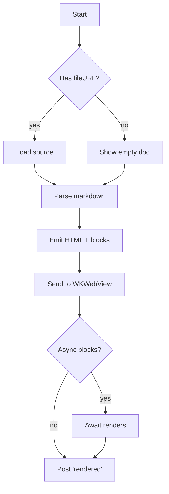
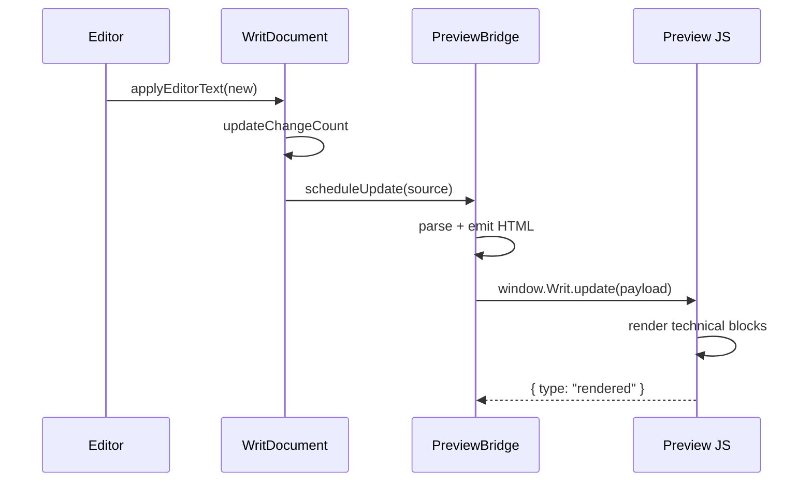
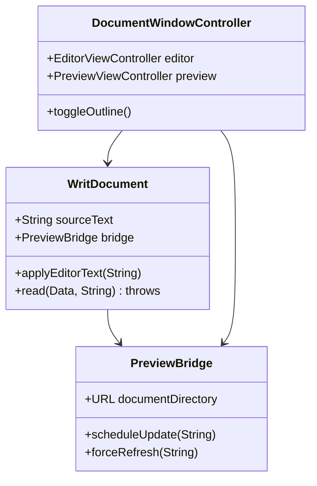
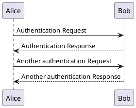
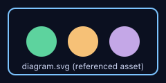
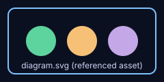

# Writ Preview Smoke Test

> Walk this document top-to-bottom in Writ's preview pane. Each section maps
> to one item in [CHECKLIST.md](./CHECKLIST.md). If any section looks wrong,
> note the section number on the checklist.

---

## 1. Headings (h1 above, h2…h6 below)

### Heading level 3
#### Heading level 4
##### Heading level 5
###### Heading level 6

Body paragraph after the headings to confirm spacing between header and prose.

---

## 2. Paragraphs, line breaks, and emphasis

A single paragraph with **bold**, *italic*, ***bold italic***, ~~strikethrough~~,
`inline code`, and a [normal link](https://example.com).

A second paragraph with a hard break — note the two trailing spaces:
this line should sit directly under the previous one.

A line ending with a backslash for explicit break,\
this is the wrapped half.

Unicode sanity check: café — naïve — Größe — 日本語 — Привет — 🎉🚀✅

---

## 3. Lists (unordered, ordered, nested, task)

Unordered with nesting:

- Alpha
- Beta
  - Beta-1
  - Beta-2 with **bold inside an item**
    - Beta-2a (third level)
- Gamma

Ordered starting at 7:

7. Seventh
8. Eighth with `inline code`
9. Ninth — [external link](https://github.com/Ceesaxp/Writ.app)

Task list:

- [x] First task completed
- [x] Second task completed with *emphasis*
- [ ] Third task pending
- [ ] Fourth task pending with [link](#)

---

## 4. Block quotes (nested)

> A first-level block quote with **bold** and `inline code`.
>
> > Nested second level — should be visibly indented further.
> >
> > > Triple-nested.
>
> Back at the first level after a nested block.

---

## 5. Horizontal rule

Above the rule.

---

Below the rule.

---

## 6. Tables with column alignment

| Left aligned | Centered | Right aligned |
|:-------------|:--------:|--------------:|
| apple        | red      |         1.20  |
| banana       | yellow   |         0.50  |
| cherry       | dark red |        12.75  |
| **bold cell**| *italic* | `code` cell   |

A wider table with mixed content:

| Feature           | Status      | Notes                          |
|:------------------|:-----------:|:-------------------------------|
| Inline math       | ✅          | KaTeX renders `$E=mc^2$`       |
| Block math        | ✅          | display mode                   |
| Mermaid           | ✅          | async, see below               |
| PlantUML          | ⚠️ syntax   | passthrough in MVP             |
| Footnotes         | ❌          | not in MVP                     |

---

## 7. Inline code and fenced code blocks

Inline: `let x = 42`, then `func main() {}` mid-sentence.

Swift, with language hint (should highlight):

```swift
import Foundation

struct Document {
    let title: String
    var sourceText: String
    var wordCount: Int { sourceText.split(separator: " ").count }
}

let doc = Document(title: "Hello", sourceText: "the quick brown fox")
print(doc.wordCount) // 4
```

Python:

```python
def fibonacci(n: int) -> int:
    a, b = 0, 1
    for _ in range(n):
        a, b = b, a + b
    return a

print([fibonacci(i) for i in range(10)])
```

JSON:

```json
{
  "name": "writ",
  "version": "0.1.1",
  "platform": ["macos-14+"],
  "features": {
    "math": true,
    "mermaid": true,
    "plantuml": "syntax-only"
  }
}
```

Plain code fence (no language — should NOT highlight, but should be monospaced):

```
$ ls -la
$ make release
```

---

## 8. Math — inline (KaTeX)

Pythagoras: $a^2 + b^2 = c^2$ inside this sentence.

Einstein: $E = mc^2$.

A fraction: $\frac{n!}{k!(n-k)!}$ for the binomial coefficient.

Square root: $\sqrt{x^2 + y^2}$.

Greek + subscript: $\sigma_x = \sqrt{\langle x^2 \rangle - \langle x \rangle^2}$.

An escaped dollar that should NOT be math: \$5.00 plus \$10.99 = \$15.99.

---

## 9. Math — block (KaTeX display mode)

Quadratic formula:

$$
x = \frac{-b \pm \sqrt{b^2 - 4ac}}{2a}
$$

Sum and integral:

$$
\sum_{n=1}^{\infty} \frac{1}{n^2} = \frac{\pi^2}{6}
\qquad
\int_{0}^{\infty} e^{-x^2}\,dx = \frac{\sqrt{\pi}}{2}
$$

A 2×2 matrix:

$$
\begin{pmatrix}
a & b \\
c & d
\end{pmatrix}
\cdot
\begin{pmatrix}
x \\
y
\end{pmatrix}
=
\begin{pmatrix}
ax + by \\
cx + dy
\end{pmatrix}
$$

Multi-line aligned equations:

$$
\begin{aligned}
(x + y)^2 &= x^2 + 2xy + y^2 \\
(x - y)^2 &= x^2 - 2xy + y^2 \\
(x + y)(x - y) &= x^2 - y^2
\end{aligned}
$$

---

## 10. Mermaid — flowchart



---

## 11. Mermaid — sequence diagram



---

## 12. Mermaid — class diagram



---

## 13. PlantUML — passthrough only (MVP scope)

The next block should display the source as-is with a "rendering is not
configured" notice. It must **not** crash or hang.



---

## 14. Images — referenced via `writ-doc://` scheme

A relative PNG (rendered from the SVG below):



A relative SVG used as an ``:



A second SVG, slimmer:


A broken reference (the diagnostics ribbon should appear once the page
settles, and an inline "missing image" placeholder should replace this img):


---

## 15. Inline (raw) SVG in HTML pass-through

Below is an inline `<svg>` element embedded directly in the markdown. It
should render as a graphic (a blue square with a yellow circle inside):

<svg xmlns="http://www.w3.org/2000/svg" viewBox="0 0 120 60" width="120" height="60">
  <rect x="0" y="0" width="120" height="60" fill="#1d4ed8"/>
  <circle cx="60" cy="30" r="20" fill="#facc15"/>
</svg>

---

## 16. Links — autolinks, named, fragment

- Autolink in angle brackets: <https://www.gnu.org/>
- Bare autolink (GFM): https://swift.org
- Named link with title: [Apple Developer](https://developer.apple.com "Apple Developer Portal")
- Reference-style link: this is a [reference link][ref-1].
- Fragment-only link to a heading in this doc: [jump to math](#8-math---inline-katex)
- Email autolink: <writ@example.com>

[ref-1]: https://github.com/Ceesaxp/Writ.app "Writ on GitHub"

---

## 17. HTML pass-through (sanitised)

Some safe inline HTML: <kbd>⌘</kbd> + <kbd>S</kbd> to save.

A `<div>` block of safe HTML:

<div style="padding: 8px 12px; border-left: 3px solid #f59e0b; background: rgba(245,158,11,0.08);">
  <strong>Note:</strong> this <em>div</em> is allowed; the sanitiser only strips dangerous tags.
</div>

A `<script>` tag — should be **stripped entirely**, with no alert:

<script>alert("XSS — if you see this dialog, the sanitiser failed")</script>

An `onerror` handler — should also be stripped:


---

## 18. Long line and wrapping

The next paragraph is intentionally a single very long line to verify that
wrapping behaves and that the line height stays consistent.

This is one long paragraph composed of many words that should soft-wrap inside the reading column without being clipped or overflowing past the right edge of the preview pane, regardless of whether the outline sidebar is open, the layout is set to Source / Split / Preview, or the window is resized to the minimum width.

---

## 19. Edge — empty fenced block and empty heading targets

Empty fenced code block (should still render an empty `<pre><code>`):

```
```

Heading with only a single character (anchor target stability):

### Z

---

## 20. End sentinel

If you can see this line and the diagnostics ribbon shows **1 issue** (the
missing `does-not-exist.png` above), every category has been exercised.
